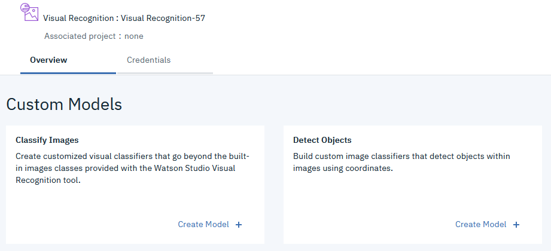
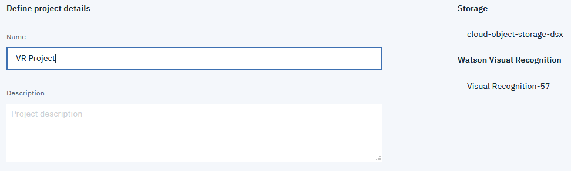
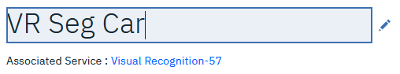
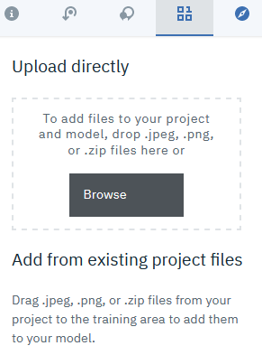
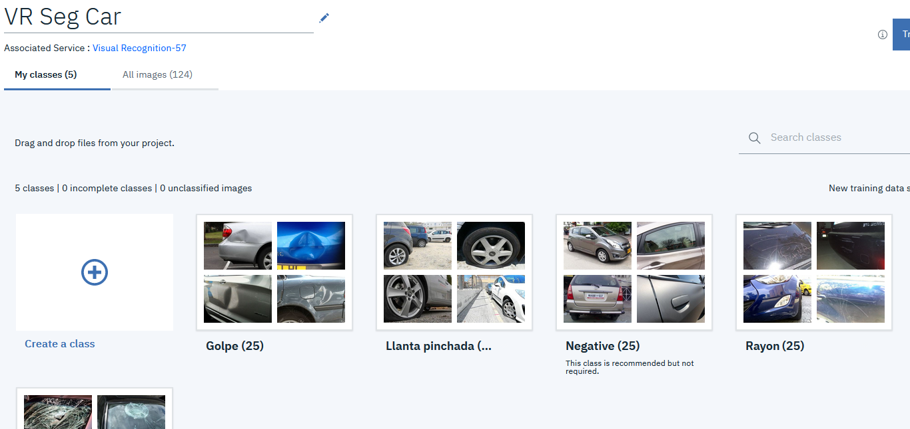
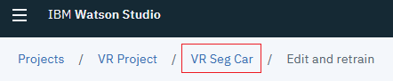
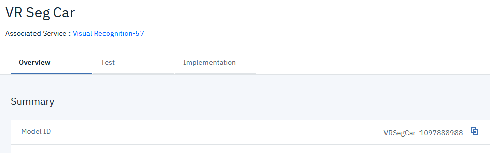
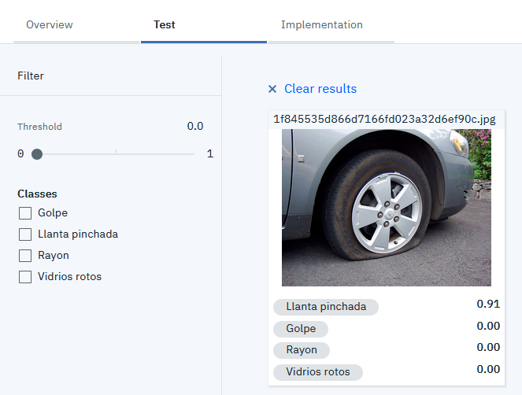

# Crear un Custom Model en Watson Visual Recognition

Watson Visual Recognition permite crear modelos de clasificación de imagenes. Este modelo se realiza a través de un entrenamiento supervisado en el que proveeremos ejemplos positivos y ejemplos negativos de clasificación.

> Para mayor información en este proceso puede revisar la [documentación de los modelos customizados de clasificación](https://cloud.ibm.com/docs/services/visual-recognition?topic=visual-recognition-customizing)

## Paso a Paso

* Haga click en el botón **Iniciar Watson Studio** en la página principal del servicio.
* Si es la primera vez que usa Watson Studio, esto preparará el ambiente de trabajo creando un Cloud Object Storage.
* Haga click en el botón **Create Model +** en el cuadro de **Classify Images**:

  

* Dele un nombre al proyecto.

  

* Asegúrese que el Storage y Watson Visual Recognition estén configurados.
* Cambie el nombre del modelo de Visual Recognition.

  

* Suba los archivos `.zip` con las clases positivas y la clase negativa ([Descargar archivos](docs/Fotos)):

  

* Una vez cargados los archivos comprimidos, las clases se mostrarán de la siguiente forma:

  

* Haga click en el botón **Train Model** y espere unos minutos.
* Cuando el entrenamiento termine, vaya a los detalles del modelo.

  

* Copie el Model ID y péguelo en el archivo `params.json` en el valor `vr_model_id`.

  

* Puede probar el modelo en la pestaña **Test**, arrastrando una nueva imagen para clasificar.

  

> Hemos terminado el modelo de clasificación, regrese al tutorial principal [Regresar](README.md#3-crear-el-servicio-watson-visual-recognition)
