# Crear un Skill para Watson Assistant

> Modificado de: [Libardo Lara](https://github.com/libardolara)

Una skill contiene los datos que Watson necesita para interactuar con el usuario de su aplicación. Watson analiza el contexto de la conversación y, a partir de esos datos, proporciona una respuesta útil al usuario.

Las habilidades o skills constan de Intenciones, Entidades y Cuadros de dialogo. Para obtener más información consulte la [documentación de IBM Watson](https://cloud.ibm.com/docs/services/assistant?topic=assistant-skills#planning-your-entities).

## Paso a Paso

### 1. Crear un Skill

* En la pagina principal del servicio Watson Assistant, haga click en la pestaña **Skills** y cree un **Dialog Skill*
* Llene el campo **Name** con el nombre. Puede ser `Seg Car Skill`:
* Seleccione el lenguaje español

<p align="left">
  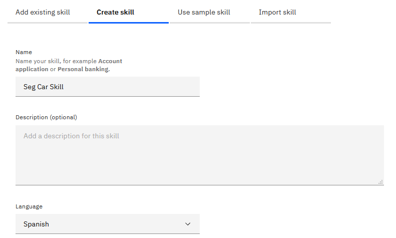
</p>

### 2. Creando Intents

Una intención en assistant es la forma en la que el usuario se expresa (Hablando o escribiendo) sobre una acción específica.
Por ejemplo, cuando se tiene la intención de dar un saludo, se puede decir de muchas formas (hola, que más, buenos días, buenas tardes, etc), pero al final, la intención se resume en un saludo. Esto es necesario para la construcción del flujo del dialogo del asistente virtual, ya que de esta forma, Watson Assistant reconoce que respuesta debe dar ante la intención X del usuario.

* En la pestaña Intent haga click en el botón **Create intent**
* Como ejemplo el nombre de la intención sera `#Presentar_Reclamacion`(para nombres de intents se suele usar la convención de guion bajo)

> Esta Intención representara el objetivo que un cliente tiene para hacer uso de su seguro de vehiculos. Un usuario expresará su deseo de presentar una reclamación sobre un daño o accidente sobre su carro.

* Haga click en el botón **Create intent**
* En el apartado de 'User example' agregue ejemplos de como un usuario expresaría su deseo de presentar una reclamación a su seguro vehicular, como por ejemplo:

```
Presentar un reclamo por daños causados
¿Cuál es el proceso para presentar un reclamo?
¿Qué se debe hacer para presentar un reclamo?
¿Cuáles son los pasos para presentar una reclamación por un vehículo?
Quiero reparar mi carro
Quiero hacer uso de mi seguro de vehiculo
Quiero realizar una reclamacion
Sufrí un accidente y requiero asistencia para el arreglo
Quiero presentar la solicitud de reparación de mi carro
Le pegue a mi carro, ¿Como puedo solicitar el arreglo?
```

<p align="left">
  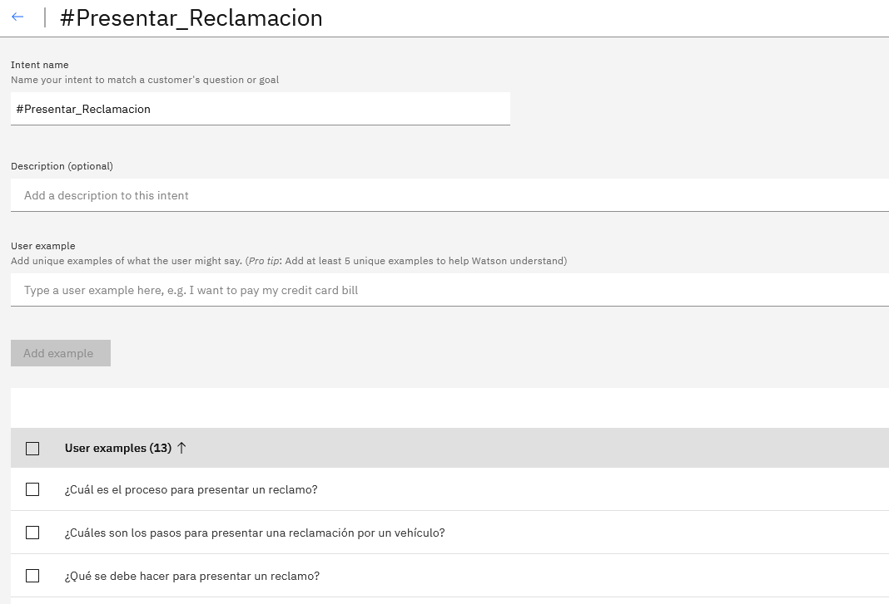
</p>

> Estos ejemplos seran usados por Watson Assistant para crear un sistema de clasificación basado en la gramatica y linguistica de los ejemplos. Es importante comentar que los errores de ortografia podrian ser entendidos pero no es una garantia completa, si la palabra cambia drasticamente es buena idea agregar una oración de ejemplo usandola.

* Cuando tenga mas de 10 ejemplos haga click en la flecha de regresar, que se encuentra en la esquina superior izquierda
* Agregue las intenciones que crea convenientes para su asistente virtual.

> IBM dispone de un catalogo de intenciones preconfiguradas para agilizar el desarrollo de un asistente virtual en la pestaña
> **Content Catalog**.


<p align="left">
  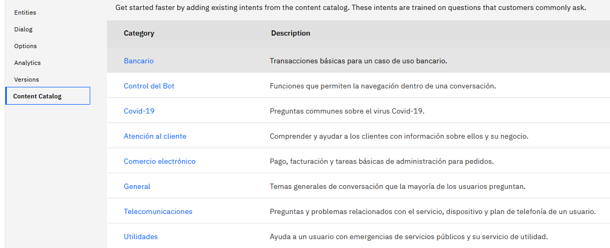
</p>

> Estas intenciones se pueden modificar, agregando ejemplos más regionales.

### 3. Creando Entities

Las entidades son como los sustantivos o palabras clave. Trabajan para identificar la naturaleza específica de la solicitud de un cliente. Al construir los términos de su negocio en entidades, su asistente puede proporcionar respuestas dirigidas a una variedad más amplia de consultas.

#### 3.1. Entities basadas en Sinónimos

* Haga click en la pestaña **Entities**
* Haga click en el botón **Create entity**
* El nombre de la primera entidad sera `Marca`
* Despues de ingresar el nombre de la entidad, haga click en el botón **Create entity**
* Agregue marcas de carros, tales como Toyota, Mazda, Audi, BMW, etc. como valores. Si es necesario puede ingresar ejemplos de sinonimos con los cuales los usuarios se pueden referir a una marca.

<p align="left">
  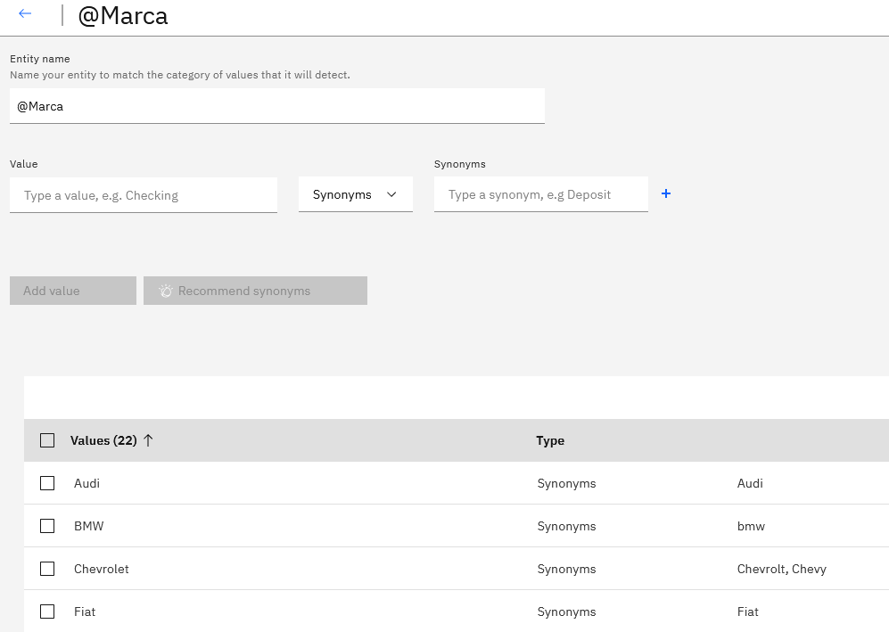
</p>


#### 3.2. Entities basadas en Patrones

* Ahora vamos a crear una entidad utilizando un patron linguistico. Vuelva a la pestaña de entidades (haciendo click en la flecha que queda en la esquina superior izquierda)
* Haga click en el botón **Create entity**
* El nombre de la entidad sera `Placa`
* Agregue un valor llamado `Placa`
* Cambie la opción **Synonyms** por **Patterns**
* En el campo Patterns ingrese el patrón `\b[a-zA-Z]{3}.?\d{3}\b` y haga click en el botón **Add value**

<p align="left">
  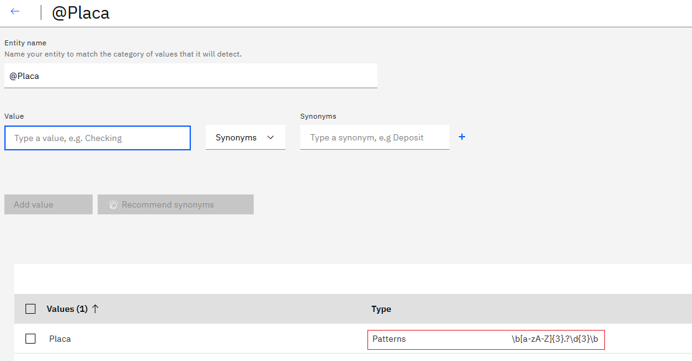
</p>

#### 3.3. Entities del Sistema

* Ahora vamos a usar una entidad del sistema. Vuelva a la pestaña de entidades (haciendo click en la flecha que queda en la esquina superior izquierda)
* Haga click en la pestaña **System entities**
* Observe las diferentes entidades del sistema, entre ellas encontrará moneda, fecha, numeros, porcentaje y tiempo.
* Haga click para activar el uso de la entidad **sys-date**

<p align="left">
  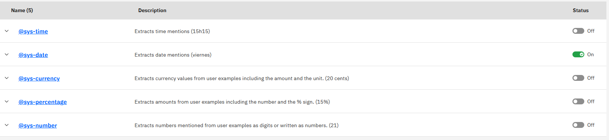
</p>

> Para mayor información puede revisar la [Documentación de Entidades](https://cloud.ibm.com/docs/services/assistant?topic=assistant-entities#entities-create-dictionary-based)

### 4. Probar el asistente 

Vamos a hacer uso del panel de prueba. Este panel permite probar el entendimiento de las intenciones, la identificación de las entidades y el flujo del dialogo. En este momento solo vamos a probar las intenciones y la entidades.

* Haga click en el botón **Try it**, que se encuentra en la esquina superior derecha
* Escriba una frase de prueba como por ejemplo, `quiero que me ayudes para que arreglen mi carro`
* Observe que la intención detectada se encuentra dentro de la lista desplegable con un **#**.
* Si la intención detectada es incorrecta puede hacer click en la lista desplegable y corregir la clasificacón seleccionando la intención correcta.
* Escriba la palabra `Mazda`
* Observe que la entidad identificada es deplegada en azul claro, con un **@**
* Realice las pruebas suficientes para la identificación de intenciones y entidades.
* Siempre que termine o vaya a hacer una nueva prueba es recomendable hacer click en el enlace **Clear** en el panel de pruebas.

<p align="left">
  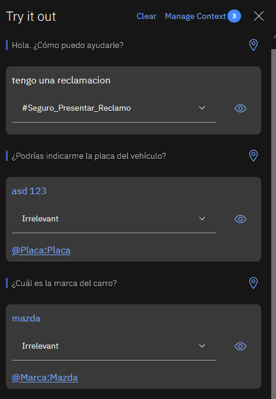
</p>

### 4. Construir el Dialogo

Un diálogo es donde se desarrolla flujos de interacción para conversaciones entre los usuarios y el asistente. Diseñe conversaciones usando intenciones y entidades para que su asistente responda adecuadamente a lo que sus clientes están diciendo.

El dialogo esta constuido por nodos, cada nodo consta principalmente de una condición(Si el asistente identifica...) y una respuesta. El asistente revisa desde arriba hacia abajo los nodos, en orden, evaluando cada condición de cada nodo, cuando se cumple alguna condición se devuelve al usuario la respuesta de dicho nodo.

<p align="left">
  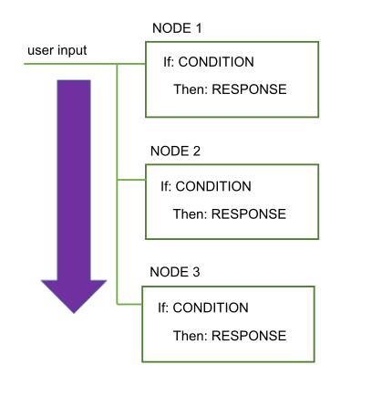
</p>

Si un nodo posee un flujo conversacional adicional, lo que conocemos como nodos hijos, la siguiente interacción por parte del usuario se evaluara contra las condiciones de los nodos hijos, de arriba hacia abajo.

<p align="left">
  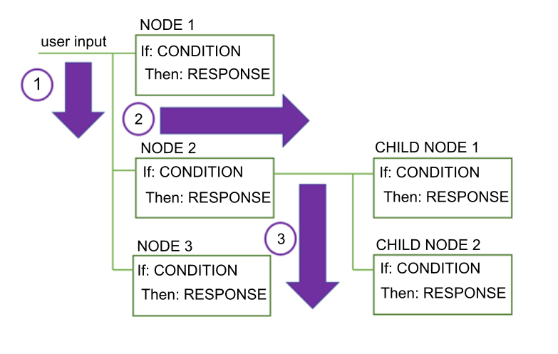
</p>

> Para mayor información puede revisar la [documentación general de dialogos](https://cloud.ibm.com/docs/services/assistant?topic=assistant-dialog-overview)

#### 4.1. Dialogo Basico

* Haga click en la pestaña **Dialog**
* Haga click en el botón **Create dialog**
* Observe que por defecto se crea un arbol conversacional con 2 nodos. **Bienvenido** y **En otras cosas**. El nodo de _Bienvenido_ es usado para que el asistente sea el primero en saludar, usado principalmente cuando el asistente esta en una pagina web o una aplicación movil. El nodo _En otras cosas_ es usado cuando no se identifica una condicón en los demas nodos, este deberia estar siempre de ultimo.

<p align="left">
  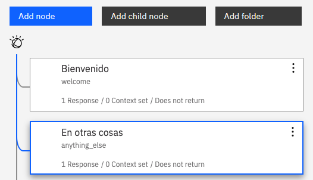
</p>

* Cada nodo puede ser diseñado como un flujo de interacciones para cada conversación.
* Vamos a crear un nuevo nodo, haga click en el botón **Add node**
* El nombre del nodo sera `Saludo`
* En la condición de reconocimiento del asistente, filtre la intención **General_Greetings**

<p align="left">
  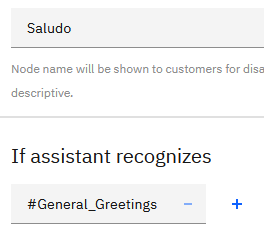
</p>

* En la respuesta del asistente observe que puede escoger entre, Texto, Opción, Pausa e Imagen. Para mayor información revise la [documentación de los tipos de respuestas](https://cloud.ibm.com/docs/services/assistant?topic=assistant-dialog-overview#dialog-overview-multimedia)

<p align="left">
  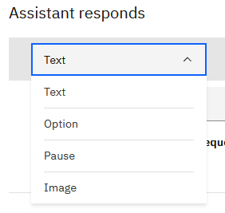
</p>

* En el campo de respuesta escribe las respuestas `Hola, soy Watson tu asistente de seguros`y `Mucho gusto, soy el asistente virtual de seguros.` O otras respuestas a un saludo del cliente.
* En las variantes de respuesta seleccione la opción **Random** para que el asistente seleccione de forma aleatoria una de las diferentes respuestas. Para mayor información revise la [documentación de las variantes a una respuesta](https://cloud.ibm.com/docs/services/assistant?topic=assistant-dialog-overview#dialog-overview-add-variety)

<p align="left">
  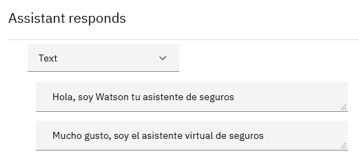
</p>

* Repita este proceso para agregar nodos para las intenciones de despedida (General_Ending), chistes (General_Jokes) y capacidades del asistente (General_Agent_Capabilities)

#### 4.2. Adquiriendo información a través de Slots

Los slots permiten recopilar información que el asistente virtual necesita para responder a un usuario dentro de un solo nodo. Un slot puede ser traducido como un espacio en blanco, que el asistente necesita llenar como información vital para ese nodo.

* Cree un nodo llamado `Presentar Reclamación` y como condición especifique que el asistente reconozca la intención **#Presentar_Reclamacion**
* Haga click en el enlace **Customize**

<p align="left">
  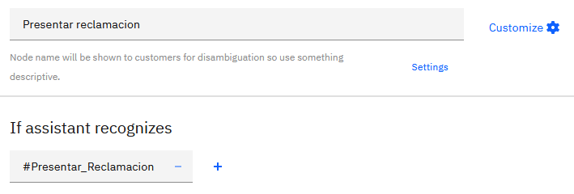
</p>

* En el panel emergente haga click para activar el uso de los Slots para este nodo y despues haga click en el botón **Apply**

<p align="left">
  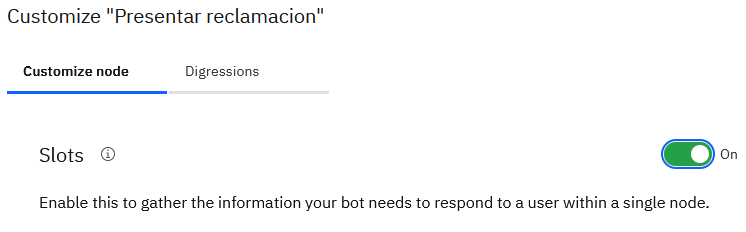
</p>

* Observe que ahora el nodo tiene un panel adicional para espeficar la información requerida.
* En el campo **Check for** especifique la entidad **@Marca**, en el campo **If not present ask** escriba que quisieraa que el asistente responda si no encuentra la entidad, por ejemplo `¿Cuál es la marca del carro?`
* Observe que la entidad detectada sera guardada en una variable de contexto identificada com **$**. Estas variables nos sirven como la memoria del asistente y pueden ser usadas en cualquier parte del nodo, ya sea como condicón o respuesta.
* Repita este proceso para la entidad **@sys-date** preguntando `¿Cuando ocurrio el incidente?`. Para esto primero haga click en el enlace **Add slot**.
* Para la entidad de placa especifique **@Placa.literal** en el campo **Check for** y en el campo **If not present ask**  la pregunta `¿Cuál es la placa del carro?

> la instrucción **.literal** indica que se desea guardar la palabra que el usuario escribio mas no su clasificación de la entidad. Si no lo usaramos para la placa obtendriamos el valor _Placa_ ya que entenderia que es una placa de carro.

<p align="left">
  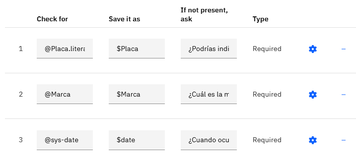
</p>

* Utilice el panel de pruebas para probar esta funcionalidad, escriba una oración como `quiero que me ayudes para que arreglen mi carro` y sigue el flujo de la conversación

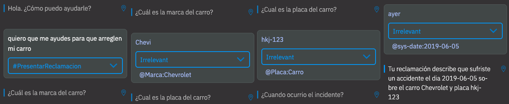

> Para mayor información revise la [documentación de recopilación de informacion con Slots](https://cloud.ibm.com/docs/services/assistant?topic=assistant-dialog-slots)

#### 4.3. Conversaciones que divagan

Las Digressions permiten que el flujo de diálogo sea dirigido por el usuario. Usted determina qué tan flexible puede ser el flujo por nodo de diálogo, desde solo proporcionar una respuesta rápida a una pregunta fuera de tema, hasta temas totalmente cambiantes en medio de una discusión.

* En el nodo **Presentar Reclamación** haga click en el botón **Customize**
* Haga click en la pestaña **Digressions** del panel emergente
* Haga click en la opción **Digressions can go away from this node** 
* Active la opción para que el nodo pueda divagar mientras esta llenando la información de los Slots.
* Como nuestro nodo de Presentar Reclamación es tal vez el mas importante de nuestro asistente virtual, vamos a garantizar que complete el proceso. Para esto vamos a seleccionar la opción **Only digress from slots to nodes that allow returns**
* Haga click en el botón **Apply**

<p align="left">
  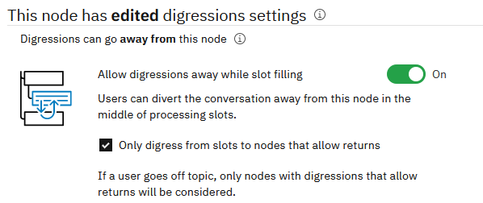
</p>

* Ahora vamos a especificar que nodos van a garantizar regresar a la conversación inicial una vez el usuario divague o cambie de tema. Para esto vamos a usar el nodo de **Chistes**, haga click en el botón **Customize** para este nodo.
* Haga click en la pestaña **Digressions** del panel emergente
* Haga click en la opción **Digressions can come into this node** 
* Seleccionar la opción **Return after digression** para que este nodo regrese a la conversación original cuando venga de un cambio de tama.
* Haga click en el botón **Apply**

<p align="left">
  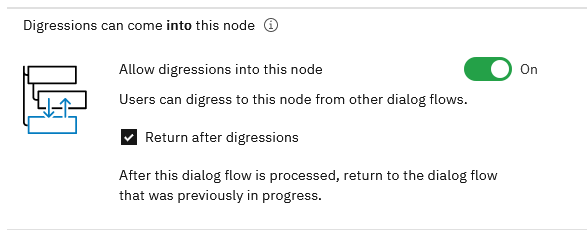
</p>

* Pruebe esta nueva respuesta en el panel de pruebas con una frase como `quiero que me ayudes para que arreglen mi carro` y en medio de las preguntas que el asistente le hace como _¿Cuál es la marca del carro?_ pregunte por un chiste `cuentame un chiste` 

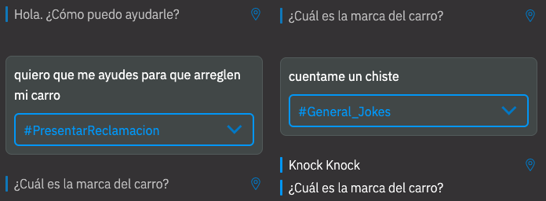

> Digressions permite cambiar de tema/conversación con flexibilidad desde un slot o un flujo conversacional. Esta funcionalidad nos permite hacer mas reales las capacidades conversacionales del asistente virtual, con conversaciones menos lineales y estructuradas. Para mayor informacíon puede revisar la [documentación de Digressions](https://cloud.ibm.com/docs/services/assistant?topic=assistant-dialog-runtime#dialog-runtime-digressions)

#### 4.4. Nodos con Multiples Respuestas

Habilite un nodo con varias respuestas para que su asistente virtual pueda proporcionar respuestas diferentes a la misma entrada, en función de otras condiciones.

* En el nodo **Presentar Reclamación** haga click en el botón **Customize**
* En el panel emergente, active la opción **Multiple conditioned responses**

<p align="left">
  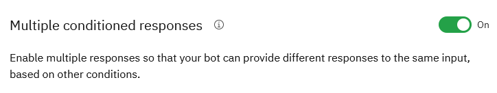
</p>

* Observe como el panel de respuestas ha cambiado. Ahora tiene una condición y una respuesta que se puede configurar con las opciones normales del asistente.
* Cuando el asistente reconozca las 3 entidades dará la respuesta (multiple en este caso)
* Haga click en el botón de personalizar respuesta, se muestra asi: 

<p align="left">
  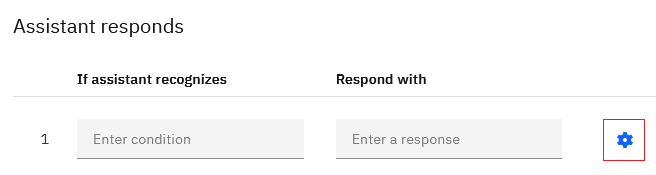
</p>

* En la primera respuesta podremos usar las variables de contexto de la siguiente forma: `Tu reclamación describe que sufriste un accidente el dia $date sobre el carro $Marca y placa $Placa`
* Agregue otra respuesta haciendo click en el botón **Add response type**
* Continue el flujo del dialogo agregando una respuesta como `Para finalizar necesito evidencia fotográfica de los daños sobre el vehículo. ¿Puedes enviarme una foto?`

<p align="left">
  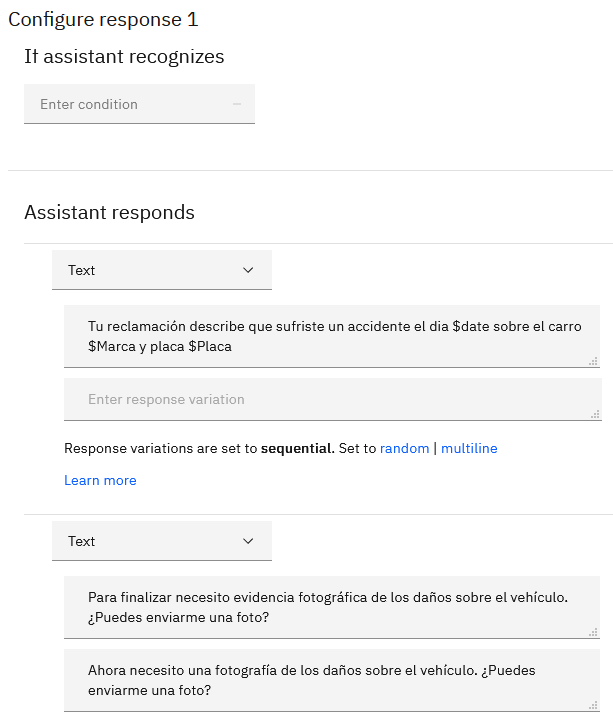
</p>

* Prueba esta nueva respuesta en el panel de pruebas

> Para mayor información revise la [documentación de multiples respuestas](https://cloud.ibm.com/docs/services/assistant?topic=assistant-dialog-overview#dialog-overview-multiple)

#### 4.5. Nodos Hijos

Continuaremos el desarrollo de nuestro arból conversacional, con los diferentes flujos de interacciones dentro de nuestro asistente virtual.

* En el nodo **Presentar Reclamacion** haga click sobre el botón de los 3 puntos y seleccione la opción **Add child node**
* Este nuevo nodo hijo será para la opcion en que el usuario no acepta el envio de una fotografia. Llamaremos al nodo **(No) Enviar foto** y su condición sera reconocer la intención **Bot_Control_Reject_Response**

<p align="left">
  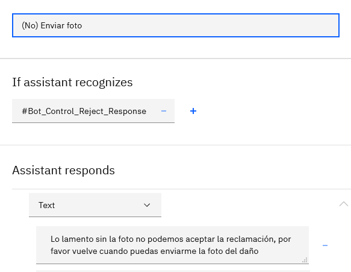
</p>

* Creee otro nodo hijo para **Presentar Reclamacion**. Esta vez llame al nodo hijo **(Si) Enviar foto** y que reconozca la intención **Bot_Control_Approve_Response**

<p align="left">
  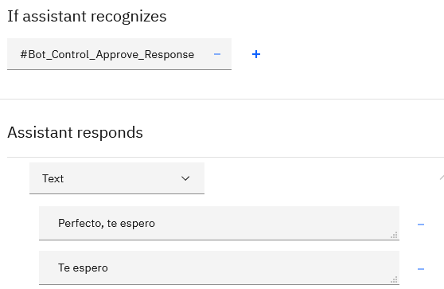
</p>

> Para mayor información acerca del [entendimiento del dialogo revise la documentación](https://cloud.ibm.com/docs/services/assistant?topic=assistant-dialog-depiction)


#### 4.6. Reutilización de conversaciones

Para finalizar vamos a mostrar como podemos reutilizar conversaciones o saltar de forma programada entre nodos. Esto nos evitará el re-trabajo

* Agregue un nuevo nodo en la raiz del asistente.
* Llame al nodo **Despedida** y por condición use la expresión **false** ya que no queremos que entre a este nodo a menos que venga de un llamado programado.
* Por respuesta usaremos frases como `Un placer ayudarte.` o `Que tengas buen día.`

<p align="left">
  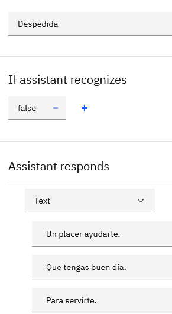
</p>

* En el nodo hijo **(No) Enviar foto** de la conversación **Presentar Reclamación**, haga click en el botón de los 3 puntos y seleccione la opción **Jump to**

<p align="left">
  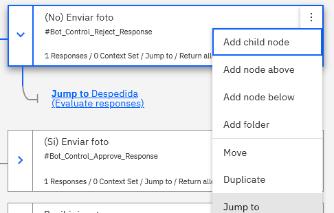
</p>

* Seleccione el nodo **Despedida**, observe que tiene 3 opciones, esperar a que el usuario haga una interacción antes de saltar, evaluar la condición del nodo, o saltar directamente a la respuesta. Seleccione la opción **Respond**

> Hemos terminado este ejercicio para crear nuestro asistente virtual de seguros, regresa al tutorial principal [Regresar](README.md#3-crear-el-servicio-watson-visual-recognition)
